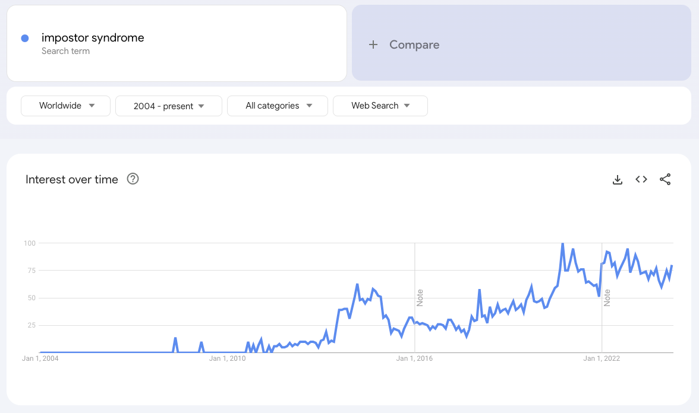

The term "Impostor Syndrome" has been around a while - at least [since 1978](https://www.psychologytoday.com/us/blog/neuroscience-in-everyday-life/202308/the-history-of-imposter-syndrome), but I'm often struck by how commonplace the term has become in the tech industry,  especially in the last 10 - 15 years. Here's a definition that occurs in [this paper](https://www.ncbi.nlm.nih.gov/pmc/articles/PMC4740363/) from "Frontiers in Psychology":

_The impostor phenomenon (IP) is defined as an internal experience of intellectual and professional incapability **despite objective evidence to the contrary**_

And in that same paper, one of the "preconditions" listed for impostor syndrome is a "fear of failure", presumably from being put in new or unfamiliar situations. 

I'm oversimplifying and there's a **lot** more to it, but I wonder about the role played by the period of zero interest rate policy (ZIRP) - particularly in the US and Canada - that started in the aftermath of the 2008 financial crisis. With a massive influx of capital into the tech industry from VCs and other sources in the years that followed, new companies were born and existing ones grew at a frenetic pace. This led to an unquenchable demand for tech talent leading to a lot of mobility between companies AND within companies, and a lot of this mobility was accompanied by promotions and raises.

How many people were quickly promoted into roles they weren't ready for? How many people were given responsibilities that they didn't feel they could handle?

Running the term "Impostor Syndrome" through Google Trends, I noticed an uptick starting in 2010.

Not conclusive by any means, but it's interesting to think about the correlation between the two.

Compared to the period between 2010 - 2022, hiring has stopped or slowed in many places. Anecdotally, promotions have become a lot harder to come by. For those that are skilled, hungry and motivated - this brings a risk of disengagement and people outgrowing their role. For others that are feeling overstretched and underwater (assuming there are no toxic work conditions or other challenges at play), I wonder if it's an opportunity to catch their breath, dig deeper into their current roles and build stability.
