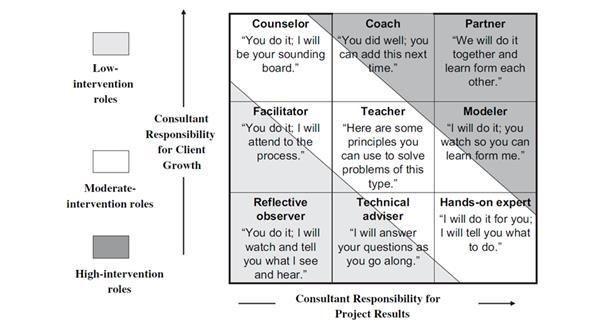
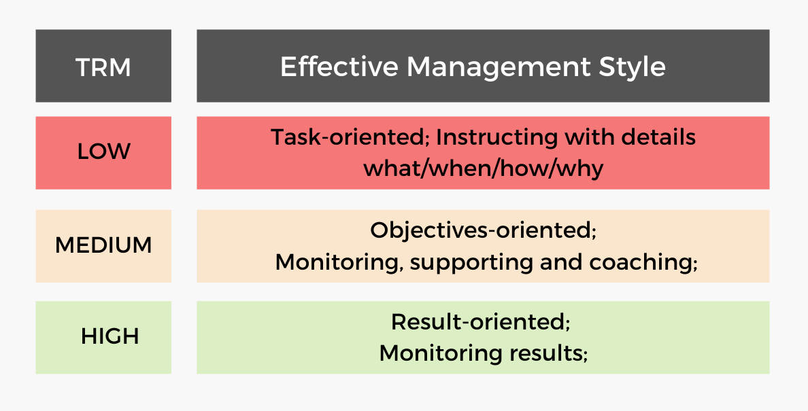
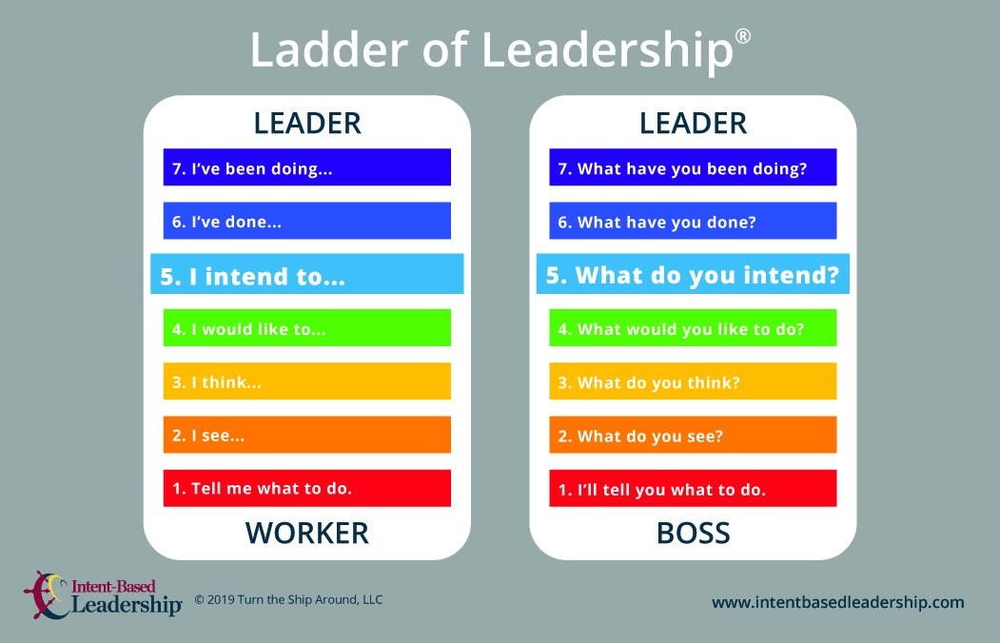
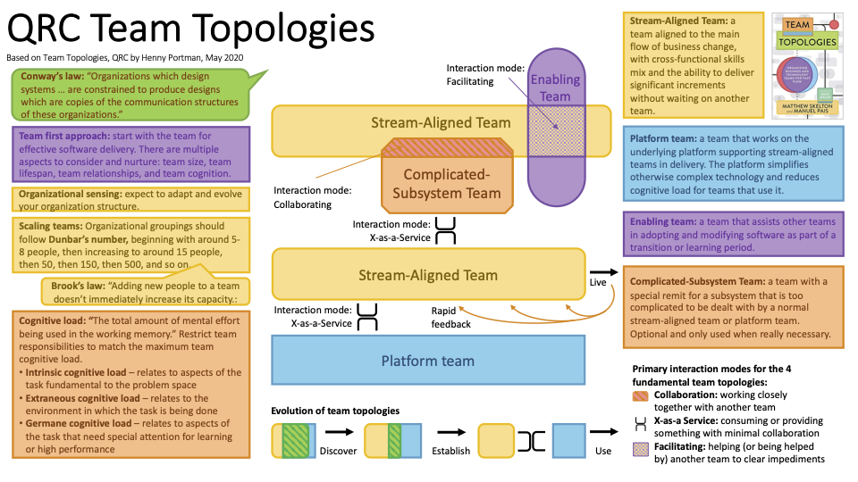

### Radical Candor

**Image Source**: [https://www.radicalcandor.com/our-approach/](https://www.radicalcandor.com/our-approach/)

**Credit for Framework**: Radical Candor by Kim Scott

{:class="img-responsive"}

### Opportunity Solution Tree

**Image Source**: [https://www.producttalk.org/opportunity-solution-tree/](https://www.producttalk.org/opportunity-solution-tree/)

**Credit for Framework**: Continuous Discovery Habits by Teresa Torres

{:class="img-responsive"}

### Stances of Helpfulness / Choosing a Consulting Role

**Image source**: [https://www.researchgate.net/figure/Typical-Role-Statements-from-the-Consulting-Role-Grid-Champion-Kiel-Mclendon-1990_fig3_281781473](https://www.researchgate.net/figure/Typical-Role-Statements-from-the-Consulting-Role-Grid-Champion-Kiel-Mclendon-1990_fig3_281781473)

**Image Author**: [https://www.researchgate.net/profile/Musleh-Alsulami](https://www.researchgate.net/profile/Musleh-Alsulami)

**Credit for Framework**: The Consulting Role Grid by Douglas Champion, David Kiel, Jean McLendon

### Task Relevant Maturity

**Image Source**: [https://www.hostinger.com/blog/task-relevant-maturity](https://www.hostinger.com/blog/task-relevant-maturity)

**Credit for Framework**: High Output Management by Andy Grove

### Ladder of Leadership

**Image Source**: [https://twitter.com/ldavidmarquet/status/1231926960693108741](https://twitter.com/ldavidmarquet/status/1231926960693108741)

**Credit for Framework**: Leadership is Language by L. David Marquet

### Team Topologies

**Image Source**: [https://hennyportman.wordpress.com/2020/05/25/review-team-topologies/](https://hennyportman.wordpress.com/2020/05/25/review-team-topologies/)

**Credit for Framework**: Team Topologies by Matthew Skelton and Manuel Pais

